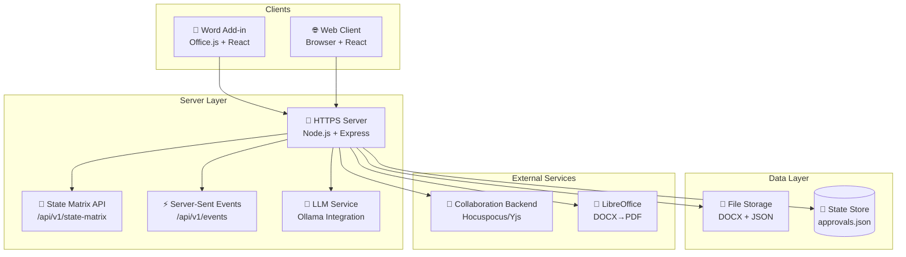

# WordFTW: Contract Authoring Platform
> Real-time collaborative document editing across Word and Web

[](LICENSE)
[](https://nodejs.org/)
[]()

**Consider this a brief. A prototype. An idea. A vision statement and meeting combined with a video and a bunch of words. Hopefully something useful in accelerating our progress down this path.**

## Table of Contents

- [🎯 What Makes This Special](#-what-makes-this-special)
- [✨ Features](#-features)
- [🚀 Quick Start](#-quick-start)
- [📋 What is WordFTW?](#-what-is-wordftw)
- [🏗️ Architecture Overview](#️-architecture-overview)
- [📁 Project Structure](#-project-structure)
- [🛠️ Development](#️-development)
- [📚 API Reference](#-api-reference)
- [🔧 Troubleshooting](#-troubleshooting)
- [🤝 Contributing](#-contributing)
- [📄 Technical Stack](#-technical-stack)
- [📖 Additional Resources](#-additional-resources)
- [📜 License](#-license)

---

## 🎯 What Makes This Special

WordFTW revolutionizes contract authoring by providing a **single source of truth** through its innovative state matrix approach. What makes it unique:

- **🎭 Cross-Platform Consistency** - Identical UI and behavior in Word add-in and web browser
- **⚡ Real-Time Sync** - Server-sent events keep all clients in perfect sync
- **🎯 State-Driven UI** - Server computes what users can see/do based on document state, user role, and platform
- **🔄 Zero-Conflict Collaboration** - Checkout/checkin workflow prevents edit conflicts
- **📄 Document Lifecycle** - Complete workflow from draft → review → finalize → vendor
- **🤖 AI-Powered Assistance** - Integrated LLM chatbot for document insights
- **📦 PDF Compilation** - Automatic packet generation from DOCX + exhibits

---

## ✨ Features

- ✅ **Cross-platform editing** - Word add-in + Web browser with identical UI
- ✅ **Real-time collaboration** - Server-sent events for instant updates
- ✅ **State-driven UI** - Single source of truth via state matrix
- ✅ **Document lifecycle** - Checkout/checkin/finalize workflow
- ✅ **PDF compilation** - DOCX + exhibits → merged packet
- ✅ **Approval workflows** - Multi-user review process
- ✅ **LLM integration** - AI-powered assistance (recent addition)
- ✅ **File management** - Exhibits upload, version control
- ✅ **Role-based access** - Different permissions per user type
- ✅ **HTTPS security** - Proper SSL certificates for production
- ✅ **Docker support** - Containerized collaboration backend

---

## 🚀 Quick Start

### Prerequisites
- ✅ Node.js 18+
- ✅ Microsoft Word (desktop)
- ✅ PowerShell with script execution enabled

### One-Command Setup (2 minutes)
```powershell
# Clone and start everything
git clone <repo-url>
cd wordFTW
./tools/scripts/servers.ps1 -Action start
```

### What Happens Next
1. **🔗 Collaboration backend** starts on port 4002
2. **🌐 Main server** starts on port 4001 (HTTPS with API)
3. **📝 Word add-in** launches automatically
4. **🌍 Web viewer** available at https://localhost:4001

### 🎯 Try It Out
- **In Word:** Use the add-in taskpane for document operations
- **In Browser:** Visit https://localhost:4001 for web editing
- **Real-time sync:** Changes appear instantly across both platforms

### Helpful Commands
```powershell
./tools/scripts/servers.ps1 -Action status   # Check service status
./tools/scripts/servers.ps1 -Action stop     # Stop all services
./tools/scripts/servers.ps1 -Action sideload # Relaunch Word add-in
```

*Prefer manual setup? See [Development](#️-development) section below.*

---

## 📸 Screenshots

*Coming soon - screenshots will be added to showcase:*
- Word add-in interface with document editing
- Web browser interface with identical functionality
- State matrix in action showing different user roles
- Real-time collaboration features
- LLM chat integration

---

## 📋 What is WordFTW?

WordFTW is an **end-to-end contract authoring platform** that seamlessly bridges Microsoft Word and web browsers through innovative architecture:

### Core Capabilities
- **🎭 Dual-Platform Experience** - Identical UI and functionality in Word add-in and web browser
- **🎯 State Matrix Architecture** - Server computes UI state based on user role, document status, and platform
- **⚡ Real-Time Synchronization** - Server-sent events keep all clients in perfect sync
- **📄 Document Management** - Canonical document with working overlays and version control
- **📦 PDF Compilation** - Automatic packet generation from DOCX + exhibits (requires LibreOffice)

### Key Innovation: State Matrix
The **state matrix** is the secret sauce - a server-computed decision engine that determines:
- Which buttons are visible to each user
- What actions are available based on document state
- How the UI adapts to different platforms
- Permission levels and workflow states

### 📖 Learn More
- **[State Matrix Explainer](docs/state-matrix-plain-english.md)** - Plain English overview
- **[Product Brief](docs/Project-Summary.md)** - Vision and roadmap
- **[Technical Architecture](docs/aiDocs/architecture/system-overview.md)** - Deep technical details

---

## 🏗️ Architecture Overview

### System Components


### Data Flow
1. **Client Request** → Word/Web sends action to server
2. **State Computation** → Server recalculates state matrix
3. **Real-time Broadcast** → SSE pushes updates to all clients
4. **UI Synchronization** → All clients update to match new state

### Key Design Principles
- **🎯 Single Source of Truth** - State matrix drives all UI decisions
- **🔄 Event-Driven Architecture** - SSE for real-time updates
- **📦 Platform Agnostic** - Same React components everywhere
- **🔒 HTTPS First** - Security built-in from day one

---

### Core Technologies
- **Backend**: Node.js 18+ + Express + HTTPS
- **Frontend**: React 18 (shared UMD module)
- **Real-time**: Server-Sent Events (SSE)
- **Collaboration**: Yjs + Hocuspocus
- **PDF Generation**: LibreOffice + pdf-lib
- **LLM Integration**: Ollama (local AI models)
- **Development**: Webpack, PowerShell scripts

### Component Breakdown

| Component | Technology | Purpose | Port |
|-----------|------------|---------|------|
| **Main Server** | Node.js + Express | API, SSE, static assets | 4001 |
| **Word Add-in** | Office.js + Webpack | Word integration | 4000 |
| **Web Client** | HTML + CSS + JS | Browser interface | 4001 |
| **Collab Backend** | Hocuspocus (Yjs) | Real-time collaboration | 4002 |
| **LLM Service** | Ollama | AI assistance | 11434 |

### Key Features
- **🔒 HTTPS Security** - Office dev certificates + proper SSL
- **📊 State Matrix** - Server-driven UI state management
- **🔄 Cross-Platform Sync** - Identical experience in Word + Web
- **📁 File Management** - DOCX storage with working overlays
- **🤝 Approval Workflows** - Multi-user review process
- **📦 PDF Compilation** - Automatic packet generation

*📖 See [macOS setup guide](docs/macos-setup.md) for cross-platform development.*

---

## 📁 Project Structure

```
wordFTW/
├── 📁 server/              # 🚀 Main API server (Node.js + Express)
│   ├── src/
│   │   ├── server.js       # Main server application
│   │   └── lib/
│   │       └── llm.js      # LLM integration layer
│   └── public/             # Static assets for web client
├── 📁 shared-ui/           # ⚛️ Cross-platform React components
│   └── components.react.js # Single UMD module for Word + Web
├── 📁 addin/               # 📝 Microsoft Word add-in
│   ├── src/                # Office.js taskpane implementation
│   └── manifest.xml        # Add-in configuration
├── 📁 web/                 # 🌐 Web client interface
│   ├── view.html           # Main web viewer
│   ├── branding.css        # Styling and themes
│   └── superdoc-init.js    # Client initialization
├── 📁 collab/              # 🔗 Collaboration backend
│   └── server.js           # Hocuspocus/Yjs server
├── 📁 data/
│   ├── app/                # 📄 Canonical documents & config
│   │   ├── documents/      # Source DOCX files
│   │   ├── exhibits/       # Supporting documents
│   │   └── config/         # Application configuration
│   └── working/            # 🔄 Working overlays & outputs
│       ├── documents/      # Modified versions
│       └── compiled/       # Generated PDFs
├── 📁 tools/
│   └── scripts/            # 🛠️ Development utilities
│       ├── servers.ps1     # Main orchestration script
│       └── *.ps1           # Individual service managers
├── 📁 docs/                # 📚 Documentation
│   ├── aiDocs/             # 🤖 AI and LLM documentation
│   └── *.md                # Guides and specifications
└── README.md               # 📖 This file
```

### Key Directories Explained
- **🏗️ Architecture**: `server/`, `shared-ui/`, `addin/`, `web/`
- **📊 Data Management**: `data/app/` (canonical), `data/working/` (working copies)
- **🔧 Development**: `tools/scripts/` (automation), `docs/` (documentation)
- **🤝 Collaboration**: `collab/` (real-time editing backend)

---

## 🛠️ Development

### Prerequisites
- ✅ **Windows 10/11** or **macOS**
- ✅ **Node.js 18+** and **npm 9+** (`node -v`, `npm -v`)
- ✅ **Microsoft Word** (desktop for add-in, optional for web-only)
- ✅ **PowerShell 5+** or **PowerShell 7+** (Windows)
- ✅ **Git** for version control
- 🔧 **LibreOffice** (optional, for PDF compilation)

### Installation & Setup

#### 1. Get the Code
```bash
# Clone repository
git clone <repo-url>
cd wordFTW
```

#### 2. First-Time Setup
```powershell
# Enable PowerShell script execution (Windows)
Set-ExecutionPolicy -Scope CurrentUser -ExecutionPolicy RemoteSigned -Force

# Install Office development certificates (optional)
npx office-addin-dev-certs install
```

#### 3. Environment Variables (for LLM features)
```powershell
# Copy and customize environment variables
cp setup-env.ps1.example setup-env.ps1

# Edit with your preferences:
$env:LLM_PROVIDER = "ollama"
$env:OLLAMA_MODEL = "gemma3:1b"
$env:OLLAMA_BASE_URL = "http://localhost:11434"
```

### Development Workflow

#### Automated Setup (Recommended)
```powershell
# Start all services with one command
./tools/scripts/servers.ps1 -Action start
```
This launches:
- 🔗 **Collaboration backend** (port 4002)
- 🌐 **Main HTTPS server** (port 4001)
- 📝 **Word add-in dev server** (port 4000)

#### Manual Setup (Advanced)
```bash
# Terminal 1: Collaboration backend
cd collab && node server.js

# Terminal 2: Main server
cd server
npm ci
node src/server.js

# Terminal 3: Word add-in
cd addin
npm ci
npm run dev-server  # Webpack on port 4000
npm start           # Sideload Word add-in
```

### Available Scripts

| Command | Description |
|---------|-------------|
| `./tools/scripts/servers.ps1 -Action start` | Start all services |
| `./tools/scripts/servers.ps1 -Action stop` | Stop all services |
| `./tools/scripts/servers.ps1 -Action status` | Check service status |
| `./tools/scripts/servers.ps1 -Action sideload` | Relaunch Word add-in |
| `npm test` | Run test suites |
| `npm run build` | Production build |

### Docker Development (Optional)
```bash
cd ops/docker
docker compose up --build -d
```
- Runs collaboration backend in container
- Maps host port 4002 → container port 4100
- Use with manual server/add-in startup

### Ports Overview
- **4000**: Word add-in development server
- **4001**: Main HTTPS server (API + Web client)
- **4002**: Collaboration backend
- **11434**: Ollama LLM service (optional)

### Troubleshooting Setup
- **Port conflicts**: Run `./tools/scripts/servers.ps1 -Action stop`
- **Certificate issues**: Use `ALLOW_HTTP=true` for HTTP-only development
- **macOS setup**: See `docs/macos-setup.md`
- **Proxy issues**: Run `npm ci` manually in each directory

---

## 📚 API Reference

### Base URL
```
https://localhost:4001/api/v1
```

### Health & Status

#### Health Check
```http
GET /api/v1/health
```
**Response:**
```json
{
  "status": "ok",
  "timestamp": "2024-01-01T12:00:00.000Z",
  "version": "1.0.0"
}
```

#### State Matrix
```http
GET /api/v1/state-matrix?platform=web|word&userId=user1
```
Returns UI state configuration based on user role, document status, and platform.

#### Users & Roles
```http
GET /api/v1/users
```
Returns available users and their roles.

### Document Management

#### Checkout Document
```http
POST /api/v1/checkout
```
```json
{
  "userId": "user1"
}
```

#### Check-in Document
```http
POST /api/v1/checkin
```
```json
{
  "userId": "user1"
}
```

#### Cancel Checkout
```http
POST /api/v1/checkout/cancel
```
```json
{
  "userId": "user1"
}
```

#### Override Checkout
```http
POST /api/v1/checkout/override
```
```json
{
  "userId": "user1"
}
```

#### Save Progress
```http
POST /api/v1/save-progress
```
```json
{
  "userId": "user1",
  "base64": "base64-encoded-docx-content",
  "platform": "word" | "web"
}
```

### Workflow Management

#### Finalize/Unfinalize
```http
POST /api/v1/finalize
POST /api/v1/unfinalize
```
```json
{
  "userId": "user1"
}
```

### Approvals System

#### Get Approvals
```http
GET /api/v1/approvals
```

#### Set Approval Status
```http
POST /api/v1/approvals/set
```
```json
{
  "userId": "user1",
  "status": "approved" | "rejected" | "pending"
}
```

#### Notify Approvers
```http
POST /api/v1/approvals/notify
```

#### Reset Approvals
```http
POST /api/v1/approvals/reset
```

### File Management

#### List Exhibits
```http
GET /api/v1/exhibits
```

#### Upload Exhibit
```http
POST /api/v1/exhibits/upload
```
Content-Type: `multipart/form-data`

#### Download Documents
```http
GET /documents/canonical/default.docx
GET /documents/working/default.docx
```

### PDF Compilation

#### Compile Packet
```http
POST /api/v1/compile
```
```json
{
  "exhibits": ["ExhibitA.pdf", "ExhibitB.pdf"]
}
```
**Response:** URL to generated PDF packet

### Real-Time Events (SSE)

#### Event Stream
```http
GET /api/v1/events
```

**Event Types:**
- `checkout` - Document checked out
- `checkin` - Document checked in
- `saveProgress` - Progress saved
- `approvals:update` - Approval status changed
- `finalized` - Document finalized
- `chat:message` - Chat message received
- `chat:delta` - Streaming LLM response chunk
- `chat:complete` - LLM response complete
- `chat:reset` - Chat conversation reset

### LLM Integration

#### Send Chat Message
```http
POST /api/v1/events/client
```
```json
{
  "type": "chat",
  "payload": {
    "text": "Hello, can you help me with this document?"
  },
  "userId": "user1",
  "platform": "word" | "web"
}
```

#### Refresh Document Context
```http
POST /api/v1/refresh-document
```
Updates the LLM's knowledge of the current document content.

### Error Responses
```json
{
  "error": "Error message",
  "code": "ERROR_CODE",
  "details": {}
}
```

### Rate Limits
- API calls: 100 requests/minute per IP
- File uploads: 10MB max per file
- Document processing: 50MB max total

*📖 For detailed API documentation, see `docs/aiDocs/` directory.*

---

## 🔧 Troubleshooting

### Quick Diagnosis
```powershell
# Check service status
./tools/scripts/servers.ps1 -Action status

# View recent logs
Get-Content server/logs/*.log -Tail 20
```

### Common Issues & Solutions

#### ❌ "Port already in use" (4000/4001/4002)
**Symptoms:** Server fails to start with "EADDRINUSE" error

**Solutions:**
```powershell
# Stop all services
./tools/scripts/servers.ps1 -Action stop

# Find and kill process manually (Windows)
netstat -ano | findstr :4001
taskkill /PID <PID> /F

# Find and kill process manually (macOS/Linux)
lsof -ti:4001 | xargs kill -9
```

#### ❌ "HTTPS certificate errors" / "NET::ERR_CERT_INVALID"
**Symptoms:** Browser shows certificate warnings

**Solutions:**
```powershell
# Install Office dev certificates
npx office-addin-dev-certs install

# Or use HTTP for development
$env:ALLOW_HTTP = 'true'
./tools/scripts/servers.ps1 -Action start

# Custom certificate (advanced)
# Place server/config/dev-cert.pfx (password: 'password')
```

#### ❌ "Word add-in not loading" / "Add-in taskpane is blank"
**Symptoms:** Word opens but add-in shows empty or error

**Solutions:**
```powershell
# Close all Word instances first
# Then relaunch add-in
./tools/scripts/servers.ps1 -Action sideload

# Check Word Trust Center
# File → Options → Trust Center → Trust Center Settings
# → Trusted Add-in Catalogs → Add: https://localhost:4000
```

#### ❌ "Save Progress fails" (Web interface)
**Symptoms:** Save operation fails with error message

**Solutions:**
- ✅ Ensure SuperDoc editor loaded (right pane)
- ✅ Check browser console for JavaScript errors
- ✅ Verify network connectivity to port 4001
- ✅ Check `Notifications` panel for error details

#### ❌ "Compile fails" / "PDF generation error"
**Symptoms:** Document compilation fails

**Solutions:**
```powershell
# Install LibreOffice
# Download from: https://www.libreoffice.org/

# Set custom path if needed
$env:SOFFICE_PATH = "C:\Program Files\LibreOffice\program\soffice.exe"

# Test LibreOffice installation
soffice --version
```

#### ❌ "LLM chat not working" / "Ollama connection failed"
**Symptoms:** Chat responses fail or timeout

**Solutions:**
```powershell
# Start Ollama service
ollama serve

# Pull required model
ollama pull gemma3:1b

# Check Ollama status
curl http://localhost:11434/api/tags

# Verify environment variables
$env:LLM_PROVIDER = "ollama"
$env:OLLAMA_MODEL = "gemma3:1b"
$env:OLLAMA_BASE_URL = "http://localhost:11434"
```

#### ❌ "Permission denied" / "Access denied" errors
**Symptoms:** Operations fail due to insufficient permissions

**Solutions:**
- ✅ Check user role in `data/app/users/users.json`
- ✅ Verify document checkout status
- ✅ Ensure correct user authentication
- ✅ Check approval workflow requirements

### Debug Tools

#### Enable Debug Logging
```powershell
$env:DEBUG = '*'
./tools/scripts/servers.ps1 -Action start
```

#### Check System Resources
```powershell
# Windows
Get-Process | Where-Object { $_.CPU -gt 10 } | Sort-Object CPU -Descending

# Check available ports
netstat -ano | findstr LISTENING
```

#### Clear Cache & Reset
```powershell
# Clear browser cache (Ctrl+Shift+R)
# Clear Node modules and reinstall
Remove-Item node_modules -Recurse -Force
npm ci

# Factory reset application data
# This clears working overlays and approvals
POST /api/v1/factory-reset
```

### Getting Help

#### 📖 Documentation
- **[State Matrix Guide](docs/state-matrix-plain-english.md)** - Understand the core logic
- **[API Documentation](docs/aiDocs/)** - Detailed endpoint reference
- **[macOS Setup](docs/macos-setup.md)** - Cross-platform development

#### 🐛 Issue Reporting
When reporting bugs, please include:
- ✅ Operating system and version
- ✅ Node.js version (`node -v`)
- ✅ Error messages and stack traces
- ✅ Steps to reproduce
- ✅ Browser console logs (F12 → Console)

#### 🚨 Emergency Recovery
```powershell
# Nuclear option: Clean restart
./tools/scripts/servers.ps1 -Action stop
Remove-Item data/working/* -Recurse -Force
Remove-Item data/app/approvals.json
./tools/scripts/servers.ps1 -Action start
```

*"If all else fails, it's probably because it's Monday. Try again Tuesday."* 😉

---

## 🤝 Contributing

### Ways to Help
- 🐛 **Bug Reports** - Found an issue? We'd love to hear about it!
- 💡 **Feature Requests** - Have ideas for improvements? Share them!
- 📖 **Documentation** - Help improve guides, tutorials, and docs
- 🧪 **Testing** - Try it out and share your experience
- 🎨 **UI/UX** - Suggest interface improvements
- 🔧 **Dev Tools** - Enhance development workflow

### Development Setup
```bash
# Fork and clone
git clone https://github.com/your-username/wordFTW.git
cd wordFTW

# Install dependencies
npm install

# Start development environment
./tools/scripts/servers.ps1 -Action start

# Visit https://localhost:4001 to see your changes
```

### Code Style Guidelines

#### 🎯 General Principles
- **Readable & Maintainable** - Code should be self-documenting
- **Consistent** - Follow existing patterns and conventions
- **Tested** - Add tests for new features
- **Documented** - Comment complex logic

#### 📝 JavaScript/React
```javascript
// ✅ Good: Clear variable names, consistent formatting
const userPermissions = getUserPermissions(currentUser);
const canEditDocument = userPermissions.includes('edit');

// ❌ Bad: Unclear, inconsistent
const perms = getPerms(user);
const canEdit = perms.indexOf('edit') > -1;
```

#### 🏗️ Architecture Decisions
- **State Matrix** - All UI state flows through the server-computed state matrix
- **Shared Components** - One React module for both Word add-in and web
- **File-based Storage** - Keep it simple, no databases for prototype
- **SSE for Real-time** - Server-sent events over WebSockets for simplicity

### Pull Request Process

#### 1. Choose Your Contribution
- **🐛 Bug Fix** - Fix an existing issue
- **✨ Feature** - Add new functionality
- **📖 Documentation** - Improve docs or guides
- **🔧 Tooling** - Enhance development experience

#### 2. Prepare Your Changes
```bash
# Create a feature branch
git checkout -b feature/amazing-new-feature

# Make your changes
# Add tests if applicable
# Update documentation

# Commit with clear message
git commit -m "feat: add amazing new feature

- What this does
- Why it's needed
- Any breaking changes
"
```

#### 3. Test Thoroughly
```bash
# Run existing tests
npm test

# Manual testing checklist
- ✅ Works in Word add-in
- ✅ Works in web browser
- ✅ No console errors
- ✅ Responsive design
- ✅ Accessibility considerations
```

#### 4. Submit Pull Request
- **Title**: `feat/fix/docs: brief description of change`
- **Description**: Detailed explanation of what and why
- **Screenshots**: For UI changes
- **Testing**: How to verify the changes work
- **Breaking Changes**: If any, with migration guide

### Areas Needing Help

#### 🚨 High Priority
- **LLM Integration** - Improve AI chat responses and context awareness
- **Error Handling** - Better user feedback for edge cases
- **Performance** - Optimize large document handling
- **Testing** - Add comprehensive test coverage

#### 💡 Feature Ideas
- **Document Templates** - Pre-built contract templates
- **Version History** - Git-like document versioning
- **Collaboration Cursors** - See where other users are editing
- **Mobile Support** - Responsive design for tablets
- **Offline Mode** - Basic functionality without network

### Recognition
Contributors will be recognized in:
- **Release notes** with credit for contributions
- **README** for significant contributions
- **GitHub discussions** for feature discussions

### Getting Started for New Contributors
1. **📖 Read the docs** - Start with `docs/Project-Summary.md`
2. **🐛 Find an issue** - Check GitHub issues labeled "good first issue"
3. **💬 Ask questions** - Use GitHub discussions for help
4. **🔧 Set up environment** - Follow the development setup above
5. **🚀 Make your first PR** - Start small, learn as you go

---

*"PRs welcome. Please bring your own tacos."* 🌮

---

## 📖 Additional Resources

### 📚 Documentation
- **[State Matrix Explainer](docs/state-matrix-plain-english.md)** - Plain English guide to the core architecture
- **[Project Summary](docs/Project-Summary.md)** - Vision, goals, and roadmap
- **[System Overview](docs/aiDocs/architecture/system-overview.md)** - Technical architecture deep-dive
- **[Word Add-in Guide](docs/aiDocs/platform/word-addin.md)** - Office.js integration details
- **[React Configuration](docs/aiDocs/platform/react-configuration.md)** - Shared UI component setup

### 🛠️ Development Resources
- **[macOS Setup](docs/macos-setup.md)** - Cross-platform development guide
- **[API Documentation](docs/aiDocs/)** - Complete endpoint reference
- **[Data Flow](docs/aiDocs/platform/data-flow.md)** - How data moves through the system
- **[Prompting Guide](docs/prompting/)** - AI interaction patterns and examples

### 🧪 Testing & Quality
- **[Smoke Tests](tools/scripts/smoke.ps1)** - Automated health checks
- **[E2E Tests](server/e2e/)** - Playwright test suite
- **[Performance Tools](tools/diagnostics/)** - Monitoring and diagnostics

### 🎯 Key Concepts
- **State Matrix** - Server-driven UI state management
- **Server-Sent Events (SSE)** - Real-time client updates
- **Document Lifecycle** - Checkout/checkin/finalize workflow
- **Platform Isolation** - Consistent experience across Word + Web
- **LLM Integration** - AI-powered document assistance

### 🔗 Related Projects
- [Office.js](https://docs.microsoft.com/en-us/office/dev/add-ins/) - Microsoft Office add-in framework
- [Hocuspocus](https://hocuspocus.yjs.dev/) - Yjs collaboration server
- [Ollama](https://ollama.ai/) - Local LLM runtime
- [React](https://reactjs.org/) - UI framework
- [Express.js](https://expressjs.com/) - Web application framework

### 📞 Support & Community
- **GitHub Issues** - Bug reports and feature requests
- **GitHub Discussions** - Q&A and community help
- **Documentation Wiki** - Community-contributed guides

---

## 📜 License

MIT for the add‑in template pieces; otherwise prototype‑grade. See headers in individual files as needed.
