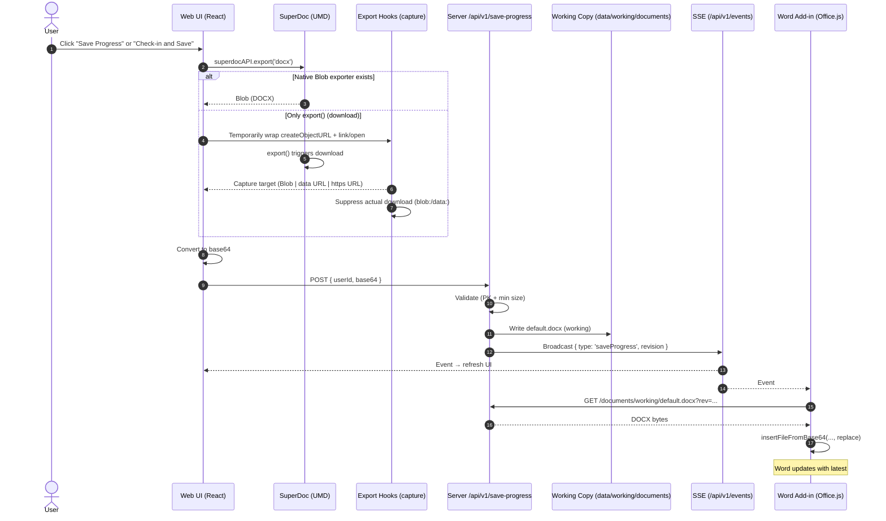

## Data Flow: Web ↔ Server ↔ Word Add‑in

This page documents the end‑to‑end data flow for saving a document from the Web editor and updating the Word add‑in, and why we intercept the export download to obtain bytes for server persistence.

### Key lesson
- SuperDoc’s `export()` in the web viewer triggers a DOCX download; it does not return bytes. To persist to the server, we must capture the download target at export time, convert to base64, and POST it to the backend.

### Web Save Progress / Check‑in flow
1. User clicks Save Progress (or Check‑in and Save) in the web UI.
2. Web calls `superdocAPI.export('docx')`.
3. If a programmatic exporter exists (e.g., `exportDocx()`), use it; else intercept `export()` download and capture bytes via one of these patterns:
   - blob URL: SuperDoc calls `URL.createObjectURL(blob)` and clicks a hidden link → capture the Blob.
   - data URL: SuperDoc sets an anchor `href` to `data:application/...;base64,...` → strip base64.
   - https URL: SuperDoc opens a same‑origin `https://...docx` → fetch the URL to get bytes (requires CORS if cross‑origin).
4. Convert captured bytes to base64.
5. POST `{ userId, base64 }` to `/api/v1/save-progress`.
6. Server validates (`PK` + min size), writes `/data/working/documents/default.docx`, bumps revision, and broadcasts SSE.
7. Web UI refreshes; Word add‑in receives SSE and pulls the latest working DOCX (`GET /documents/working/default.docx?rev=...`), opening it with `insertFileFromBase64`.

### Sequence diagram

### Implementation notes
- Capture/suppress is implemented in `web/superdoc-init.js` under `window.superdocAPI.export('docx')`:
  - Prefer `exportDocx()`/`exportPdf()` when available.
  - Fallback wraps `URL.createObjectURL`, `HTMLAnchorElement.prototype.click`, and `window.open` around a single `export()` call, restores them immediately, and returns base64.
  - Suppress user‑visible downloads for `blob:` and `data:` cases.
- Server endpoint: `POST /api/v1/save-progress` validates and persists the working copy and emits SSE.
- Word add‑in path: listens to SSE and opens latest working DOCX via `insertFileFromBase64`.

### Troubleshooting
- If fallback detects an `https:` export URL, ensure it’s same‑origin or CORS‑enabled so the web viewer can `fetch` it.
- Save validations: failures with `export_invalid` usually mean base64 too small or missing ZIP magic (`PK`).

